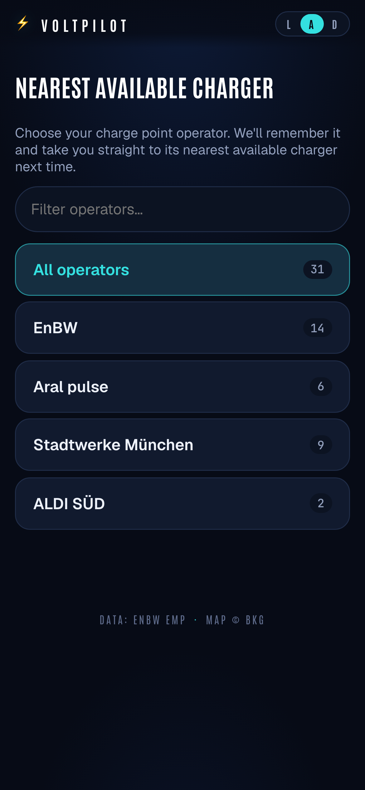
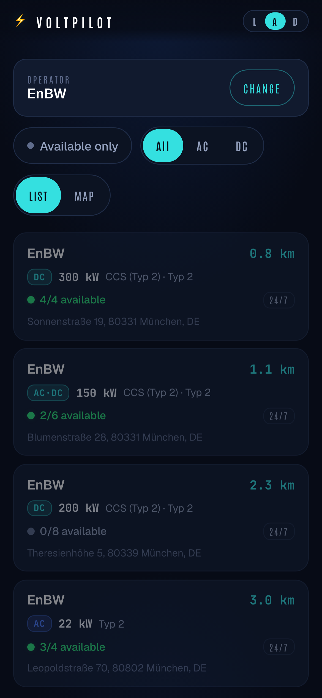
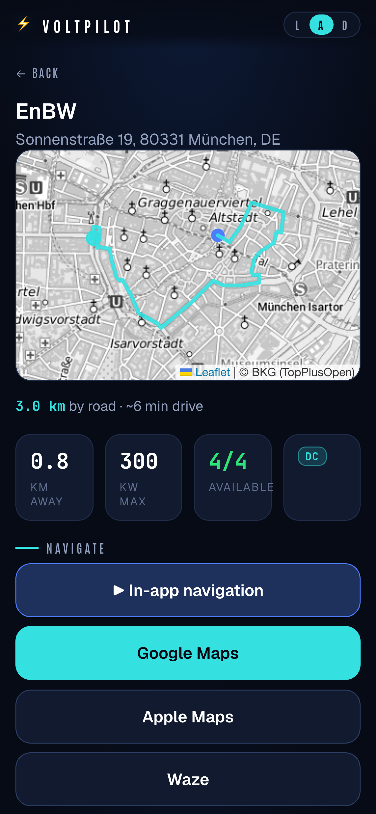

# voltpilot ⚡

Get to the **nearest available charger of your chosen Charge Point Operator (CPO)** in the fewest possible taps, then hand off to your navigation app.

Pick your CPO once — voltpilot remembers it and, on every return visit, drops you straight onto that operator's chargers near you, sorted nearest-first and filterable by availability and AC/DC. Tap one to open it in Google Maps, Apple Maps, or Waze.

It's a PWA backed by a small Go service that proxies the public [EnBW e-mobility API](https://www.enbw.com/elektromobilitaet/) (a roaming aggregator covering many CPOs).

<p align="center">
  
  &nbsp;
  
  &nbsp;
  
</p>

<p align="center"><sub>Example location: Munich. Screenshots are generated automatically — see <a href="#screenshots">Screenshots</a>.</sub></p>

## Features

- **Pick a CPO, remembered for next time** — first launch lists operators near you; your choice is stored locally.
- **Nearest-first list** of that CPO's chargers, with an optional map view.
- **Filters**: available-only, and AC / DC / all.
- **One-tap navigation** via Google / Apple / Waze deep links.
- **On-device route preview** — for chargers within 5 km, a route line + road distance/ETA computed client-side from OpenStreetMap (Overpass), no routing service or key. Straight-line fallback beyond 5 km.
- **In-app navigation (last-mile)** — optional full-screen turn-by-turn for ≤5 km trips: selectable map orientation (North-up / Course-up / device Compass), turn instructions with street names, voice guidance (Web Speech), auto-reroute, screen wake-lock. All client-side. Screen-on / phone-in-hand only (PWA limitation) — the deep-link buttons remain for full background nav.
- **Installable PWA** with geolocation; works on mobile.

## Architecture

```
web/        SvelteKit static PWA (embedded into the Go binary via //go:embed)
cmd/server  Go entrypoint
internal/
  enbw/     EnBW API client + subscription-key manager (scrapes the rotating key)
  chargers/ typed charger/CPO views: filter, AC/DC classify, rank, deep links
  cache/    45s in-process TTL cache (no Redis / no database)
  geo/      haversine distance + bounding-box derivation
  api/      chi router, handlers, middleware
web/src/lib/routing/  client-side A* over OSM/Overpass for the route preview
charts/     Helm chart (nginx ingress + cert-manager)
```

The backend keeps the EnBW subscription key server-side, refreshes it by scraping the public map page, caches bounding-box queries briefly, and backs off on the API's aggressive throttle (HTTP 403).

### API

| Endpoint | Purpose |
|----------|---------|
| `GET /api/cpos?lat&lon&radiusKm` | distinct operators near a point |
| `GET /api/chargers?lat&lon&radiusKm&operatorCode&current&availableOnly&limit` | ranked, filtered chargers |
| `GET /api/chargers/{id}?lat&lon` | station detail: per-EVSE status, connectors, nav links |
| `GET /api/healthz` | health probe |

## Develop

```sh
# backend (terminal 1)
go run ./cmd/server          # :8080, proxies the EnBW API

# frontend (terminal 2)
cd web && npm install && npm run dev   # :5173, proxies /api → :8080
```

### Build a production binary (frontend embedded)

```sh
make build-prod   # → bin/voltpilot
```

### Test

```sh
make test                 # Go unit tests + coverage
cd web && npm run test:unit
cd web && npx playwright test   # e2e (mocks /api, fully offline)
```

## Screenshots

The README screenshots are generated, not hand-captured, so they stay in sync with the UI:

```sh
cd web && npm run screenshots
```

This builds the app, serves it with `vite preview`, and drives Chromium (mobile viewport, Munich geolocation, deterministic mocked `/api` data) via Playwright, writing `docs/screenshots/{picker,list,detail}.png`. Re-run it after any change that affects the UI and commit the updated images. Capture logic: `web/tests/screenshots/capture.spec.ts` + `web/playwright.screenshots.config.ts`.

## Configuration

| Env var | Default | Purpose |
|---------|---------|---------|
| `VOLTPILOT_LISTEN_ADDR` | `:8080` | HTTP listen address |
| `VOLTPILOT_ENBW_KEY` | _(empty)_ | optional seed for the EnBW subscription key |
| `VOLTPILOT_ENBW_MAP_URL` | EnBW map page | page scraped for the rotating key |
| `VOLTPILOT_KEY_REFRESH_INTERVAL` | `6h` | how often the key is re-scraped |

## Data & credits

Charge-point data from the EnBW e-mobility public API. Routing data © OpenStreetMap contributors (via Overpass). Map tiles: BKG TopPlusOpen © Bundesamt für Kartographie und Geodäsie (dl-de/by-2.0) — EU-hosted. voltpilot is an independent hobby project and is not affiliated with EnBW.

## License

MIT
